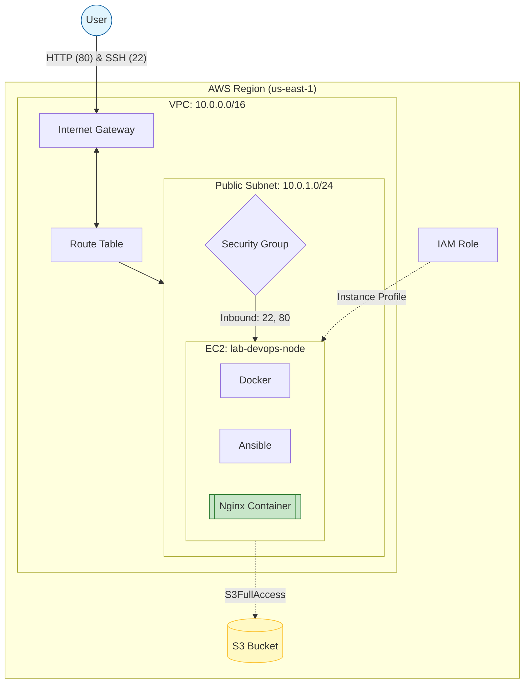

# Lab: AWS Infra

**lab-aws-infra** is a basic Infrastructure as Code project that automates the deployment of a DevOps environment on AWS using Terraform.

This lab sets up a network, an S3 bucket, and an EC2 instance pre-installed with Docker and Ansible.

---

## Architecture




## Features

**Custom Networking**: Custom VPC and Subnet.  
**Auto-Provisioning**: Docker and Ansible installed automatically on boot.  
**Storage**: Creates a private S3 bucket for your files.  
**Security**: Uses IAM Roles instead keys.  


## Prerequisites
1. Install Terraform
2. Install & Configure AWS CLI

Install:
```bash
sudo apt install awscli
```

Create an IAM User in the AWS Console with AdministratorAccess.

Generate an Access Key ID and Secret Access Key.

Run the following command and enter your keys.
```bash
aws configure
```

Verify your identity:
```bash
aws sts get-caller-identity
```


## Deployment Steps

1. Clone Repository
```bash
git clone https://github.com/emirctl/lab-aws-infra.git
cd lab-aws-infra
```

2. Initialize Terraform
```bash
terraform init
```

3. Review resources
```bash
terraform plan
```

4. Apply and deploy
```bash
terraform apply
```


## Check service
**Web Access**: Open http://<instance_public_ip> in your browser to see the live Nginx container.


## Cleanup
Destroy resources

```bash
terraform destroy
```


## License

This project is licensed under the MIT License.
